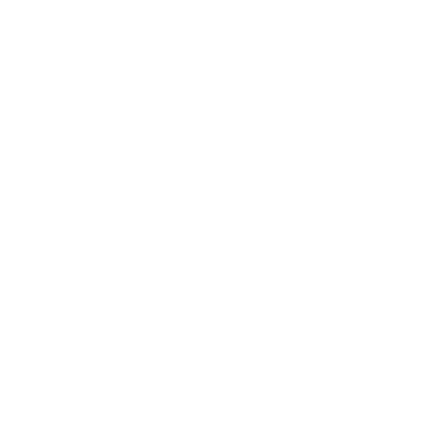

<p align="center">
  
</p>

# LotoT Android

LotoT Android is the in-vehicle companion application for the LotoT vehicle-health platform. It combines the proven native diagnostic engine from [AndrOBD](https://github.com/fr3ts0n/AndrOBD) with a purpose-built React/WebView cockpit, integrated phone sensors, GPS, and MQTT telemetry publishing.

## What it does

- Connects to ELM327-compatible adapters using Bluetooth Classic, Bluetooth LE, USB, or Wi-Fi where supported by the native engine.
- Polls and decodes OBD-II live data, readiness information, freeze frames, vehicle information, and diagnostic trouble codes.
- Presents a compact LotoT health cockpit with domain-specific temperature, voltage, pressure, fuel, airflow, and time-series visualizations.
- Integrates GPS and phone accelerometer measurements directly in the APK.
- Publishes device-scoped telemetry snapshots to the LotoT Django platform over MQTT.
- Keeps AndrOBD's advanced native diagnostic screens available behind the LotoT interface.

## Architecture

```text
ELM327 / vehicle
       ↓
AndrOBD native diagnostic engine
       ↓
Java ↔ JavaScript bridge
       ↓
LotoT React cockpit
       ↓
MQTT over the phone's internet connection
       ↓
LotoT Django vehicle-health platform
```

The companion server/web application is maintained separately in the `vehicle-health-platform` repository.

## Project layout

```text
androbd/      Android application and native OBD integration
library/      Shared upstream diagnostic libraries
plugin/       Upstream extension framework retained for compatibility
lotot-ui/     React/Vite source for the embedded LotoT cockpit
customisation/ AndrOBD customization resources
```

## Build

Requirements include a compatible JDK, Android SDK, and Node.js/npm.

```bash
cd lotot-ui
npm install
npm run build

cd ..
./gradlew :androbd:assembleDebug
```

The generated React bundle is copied into `androbd/src/main/assets/lotot/` by the UI post-build script.

## Upstream relationship

This project is derived from AndrOBD and preserves its Git history, copyright notices, and GPL-3.0 licensing. The recommended remote layout is:

```text
origin    https://github.com/lotfinity/lotot-android.git
upstream  https://github.com/fr3ts0n/AndrOBD.git
```

The original AndrOBD README is preserved at [`docs/ANDROBD_UPSTREAM_README.md`](docs/ANDROBD_UPSTREAM_README.md).

## License

Licensed under the GNU General Public License v3.0. See [`LICENSE`](LICENSE).
## Live UI development

The debug build supports Vite hot reload over a private LAN or Tailscale connection. See [`docs/LIVE_UI_DEVELOPMENT.md`](docs/LIVE_UI_DEVELOPMENT.md).
